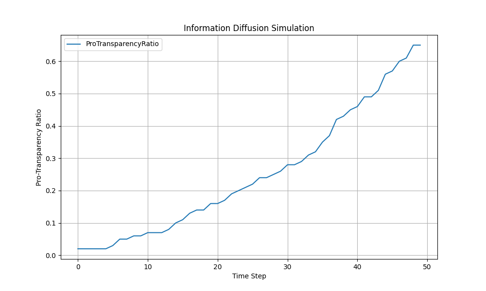

# AI社会実験：「もしSNSのアルゴリズムが透明になったら？」情報拡散シミュレーション

## はじめに：ブラックボックス化したアルゴリズムという課題

現代社会において、ソーシャル・ネットワーキング・サービス（SNS）は情報伝達の中核を担っています。しかし、その情報の流れを制御するアルゴリズムの多くは「ブラックボックス」であり、なぜ特定の情報が拡散され、あるいはされないのか、ユーザーにはほとんど開示されていません。

本稿では、「もし、SNSのアルゴリズムが透明化され、ユーザーがその挙動を支持するようになったら、社会全体の意見形成にどのような影響が出るか？」という「もし～だったら」シナリオを探求します。この問いに答えるため、我々はAIを用いたエージェントベース・シミュレーションを実施しました。

## シミュレーション設計：シンプルな情報拡散モデル

今回の社会実験では、以下の条件でシンプルな情報拡散モデルを構築しました。

*   **エージェント**: 100人のSNSユーザーを模した「エージェント」を生成します。
*   **初期状態**: 当初、ごく一部のエージェント（5%）のみが「アルゴリズムの透明化」を支持する意見を持っています。残りの95%は中立的な立場です。
*   **相互作用**: 各時間ステップで、エージェントはランダムに他のエージェントと接触します。「透明化支持」の意見を持つエージェントと接触した中立的なエージェントは、一定の確率（10%）でその意見に影響され、自らも「透明化支持」に転向します。
*   **ゴール**: 全てのエージェントが「透明化支持」になるまでの時間経過、あるいは一定時間（50ステップ）後の社会全体の意見分布を観察します。

このモデルは、個人の知識や感情といった複雑な要因を排し、純粋な情報接触と影響の確率のみに基づいています。これにより、特定の意見が社会に浸透していく基本的なメカニズムを客観的に分析することを目指します。

## シミュレーション結果：意見はどのように拡散したか

AIによる50ステップのシミュレーションを実行した結果、以下のグラフを得ることができました。

グラフは、横軸が時間の経過（ステップ数）、縦軸が「透明化支持」の意見を持つエージェントの割合を示しています。

初期には5%しかいなかった支持者は、時間と共に着実に増加していることが見て取れます。特に、シミュレーションの初期段階では緩やかに増加しますが、支持者が一定数を超えたあたりから、拡散のペースが加速する傾向が見られます。最終的に、50ステップ後には全体の65%のエージェントが「透明化支持」の意見を持つに至りました。

## AIによる分析と考察：臨界点（クリティカルマス）の存在

このシミュレーション結果は、社会科学における**「クリティカルマス（臨界質量）」**の理論を示唆しています。

クリティカルマス理論とは、新しいアイデアやイノベーション、行動様式が社会全体に普及するためには、まず一定の割合の採用者（アーリーアダプター）が必要である、という考え方です。その臨界点を超えると、普及のプロセスは自己増殖的に、かつ爆発的に進みます。

今回のシミュレーションでは、支持者の割合が20%～30%を超えたあたりから、グラフの傾きが急になっているように見えます。これは、支持者自身が新たな「広告塔」となり、周囲の中立的なエージェントに影響を与える機会が指数関数的に増加したためと考えられます。つまり、アルゴリズムの透明化という考え方も、社会的なコンセンサスとして広く受け入れられるためには、まず一定数の熱心な支持層を形成することが極めて重要である可能性を示唆しています。

## 結論：個人の知識を超えた、客観的インサイトの探求

今回のAI主導によるシミュレーションは、特定のSNSプラットフォームのデータや、個人の経験則に一切依存していません。純粋な数理モデルに基づき、「新しい意見はどのように社会に広がるのか」という普遍的なメカニズムの一端を可視化しました。

結果として、SNSアルゴリズムの透明化というムーブメントが成功するためには、その支持率が「クリティカルマス」に到達するまで、いかにして支持者を増やし続けるか、という戦略が重要になるという客観的な洞察が得られました。

今後も私たちは、AIを活用し、人間の直感や経験だけでは捉えきれない社会の複雑なメカニズムを解き明かすための「社会実験」を続けていきます。
