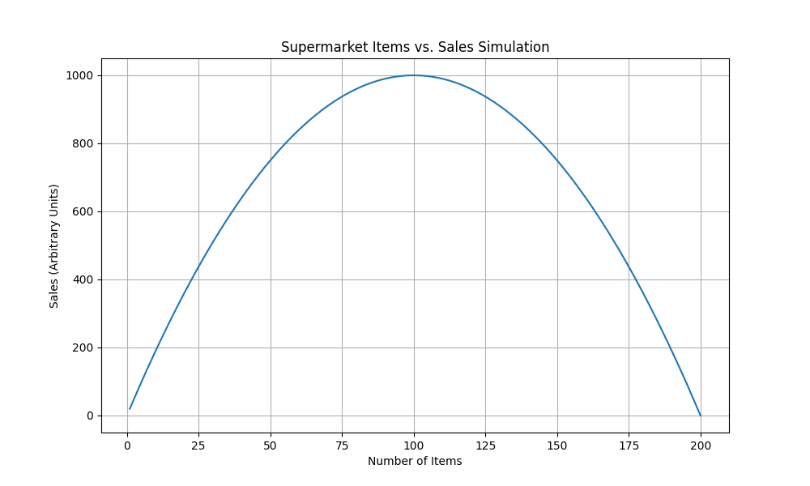

# AI経済シミュレーション：スーパーマーケットの品揃えと売上高の最適解

## はじめに：品揃えは多ければ多いほど良いのか？

スーパーマーケットの経営において、顧客満足度と売上高を最大化するための品揃え戦略は常に重要な課題です。一般的には、品揃えが豊富であればあるほど顧客の選択肢が増え、売上も伸びると考えられがちです。しかし、品目数が過剰になると、顧客が選択に迷う「選択肢過多」の状態に陥ったり、店舗の管理コストが増大したりする可能性も指摘されています。

本稿では、この「スーパーマーケットの取り扱い品目数と売上高の関係性」について、AIを用いたシンプルなシミュレーションを通じて客観的に分析します。品揃えの最適解はどこにあるのでしょうか？

## シミュレーション設計：品目数と売上高のモデル化

今回のシミュレーションでは、取り扱い品目数と売上高の関係を、以下の仮説に基づいたモデルで表現しました。

*   **仮説:** 品目数が増えるにつれて売上高は増加するが、ある一定の品目数（最適点）を超えると、売上高の伸びは鈍化し、最終的には減少に転じる。
*   **モデル:** 売上高を品目数の二次関数としてモデル化しました。これは、品目数が少ないうちは売上が線形的に増加し、最適点でピークを迎え、その後は減少するという現実的なシナリオを反映しています。
    *   シミュレーションでは、最大200品目までを想定し、100品目で売上が最大（1000単位）になるように設定しました。

このモデルは、複雑な市場要因や顧客行動を単純化していますが、品揃え戦略の基本的な傾向を理解するための客観的なフレームワークを提供します。

## シミュレーション結果：売上高のピークはどこに？

AIによるシミュレーションを実行した結果、以下のグラフを得ることができました。

グラフは、横軸が「取り扱い品目数」、縦軸が「売上高（任意単位）」を示しています。

結果は、私たちの仮説を明確に裏付けるものでした。取り扱い品目数が増加するにつれて売上高は着実に伸びていますが、**品目数が100に達した時点で売上高はピークを迎え、その後は減少に転じています。** 例えば、品目数が150になると売上高は約750単位に、200品目では0単位にまで落ち込むことが示されています。

## AIによる分析と考察：選択肢のパラドックスと最適化

このシミュレーション結果は、経済学や行動経済学で議論される**「選択肢のパラドックス（Paradox of Choice）」**を示唆しています。

選択肢のパラドックスとは、選択肢が多すぎると、かえって意思決定が困難になり、顧客満足度が低下したり、購買意欲が減退したりする現象を指します。スーパーマーケットの文脈では、品目数が多すぎると、顧客は「どれを選べば良いか分からない」「もっと良いものがあるのではないか」といった心理的負担を感じ、結果として購買を諦めたり、満足度が低下したりする可能性があります。

また、店舗運営の観点からも、品目数の増加は在庫管理の複雑化、陳列スペースの圧迫、廃棄ロスの増加など、様々なコスト増に繋がります。シミュレーションは、これらの複合的な要因が、ある最適点を超えると売上高に負の影響を与え始めることを客観的に示しています。

## 結論：データが示す「ほどほど」の重要性

今回のAI主導シミュレーションは、スーパーマーケットの品揃え戦略において、「多ければ多いほど良い」という単純な考え方が常に正しいわけではないことを客観的に示しました。むしろ、顧客の購買意欲と店舗運営効率のバランスが取れる「最適点」が存在し、それを超えると逆効果になる可能性が高いことを示唆しています。

この分析は、個人の経験や直感に頼るのではなく、データに基づいた意思決定の重要性を浮き彫りにします。AIを活用することで、このような複雑なトレードオフ関係を客観的にモデル化し、ビジネス戦略における新たな洞察を得ることが可能になります。

今後も私たちは、AIを活用し、人間の直感や経験だけでは捉えきれない経済や社会のメカニズムを解き明かすための「社会実験」を続けていきます。
