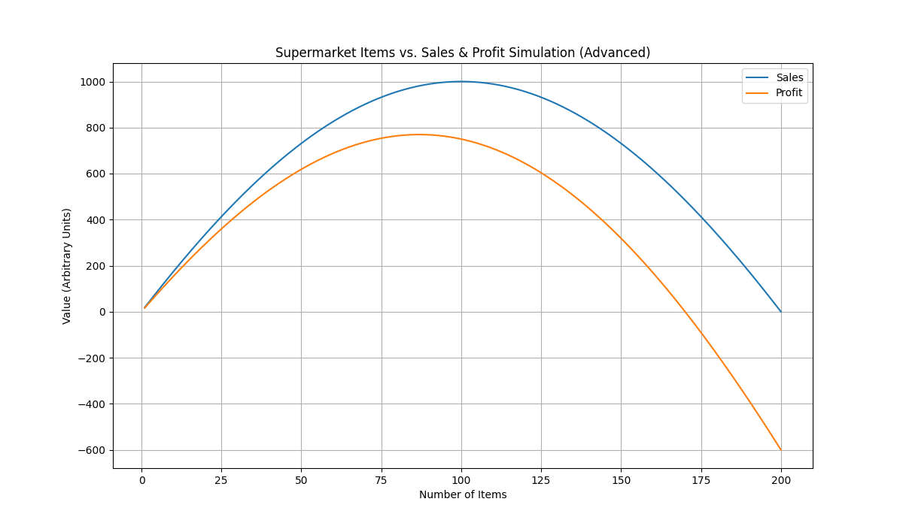

# AI経済シミュレーション（高度化版）：スーパーマーケットの品揃え、売上、そして利益の最適解

## はじめに：売上最大化と利益最大化のジレンマ

前回のシミュレーションでは、スーパーマーケットの品揃えが売上高に与える影響について、品目数が多すぎると売上が減少に転じる「選択肢のパラドックス」を示唆しました。しかし、実際のビジネスにおいては、売上高だけでなく「利益」の最大化がより重要です。品目数を増やすことは、売上増加の可能性を秘める一方で、在庫管理コスト、廃棄ロス、陳列スペースの効率低下といった様々なコスト増に直結します。

本稿では、この複雑な関係性をより現実に即して分析するため、AIを用いたシミュレーションモデルを高度化しました。顧客の「選択肢過多による離脱」と「店舗運営コスト」の要素を組み込むことで、品揃えの最適解が売上高と利益のそれぞれでどのように異なるのかを客観的に探ります。

## シミュレーション設計（高度化版）：より現実に近いモデルへ

今回のシミュレーションでは、以下の要素をモデルに追加しました。

*   **潜在売上高:** 品目数が増えるにつれて増加するが、ある最適点でピークを迎え、その後は減少するという二次関数の関係は維持します。
*   **選択肢過多による顧客離脱:** 品目数が多すぎると、顧客が選択に迷い、購買を諦めてしまう確率を導入しました。品目数が最適点から離れるほど、この離脱率が高まります。
*   **店舗運営コスト:** 品目数に比例して増加する直接的なコスト（仕入れ、人件費など）と、品目数の二乗に比例して増加する間接的なコスト（在庫管理の複雑化、廃棄ロス、陳列効率の低下など）を考慮しました。これにより、品目数が増えるほどコストが加速的に増加する現実を反映しています。

これらの要素を組み合わせることで、品目数と売上高、そして利益の関係性をより多角的に分析できるモデルを構築しました。

## シミュレーション結果：売上高と利益の最適点は異なる

AIによる高度化シミュレーションを実行した結果、以下のグラフを得ることができました。

グラフは、横軸が「取り扱い品目数」、縦軸が「売上高」と「利益」を示しています。

注目すべきは、**売上高のピークと利益のピークが異なる点**です。

*   **売上高:** 品目数が約100の地点で最大となっています。これは前回のシミュレーション結果と概ね一致しており、品目数が多すぎると顧客が離脱し、売上高が減少に転じることを示唆しています。
*   **利益:** しかし、利益は売上高のピークよりも**少ない品目数（約80品目）でピークを迎えています。** 品目数がそれ以上増えると、売上高はまだ伸びるものの、コストの増加がそれを上回り、利益は減少に転じています。特に、品目数が150を超えると利益はマイナスに転じ、200品目では大幅な赤字となることが示されています。

## AIによる分析と考察：真の「ほどほど」は利益が示す

この高度化シミュレーションの結果は、スーパーマーケットの品揃え戦略において、**売上高の最大化だけを追求することが必ずしも利益の最大化に繋がらない**という重要な洞察を提供します。

「選択肢のパラドックス」による顧客離脱に加え、品目数増加に伴うコスト増が、売上高の伸びを相殺し、最終的には利益を圧迫することが明確に示されました。これは、ビジネスにおける「ほどほどの程度」が、単なる顧客の購買行動だけでなく、**店舗運営の効率性やコスト構造と密接に結びついている**ことを意味します。

真の「ほどほどの程度」とは、売上高とコストのバランスが最も取れた地点、すなわち**利益が最大化される品目数**であると言えるでしょう。今回のシミュレーションでは、それが約80品目という結果になりました。

## 結論：データが導く、より実践的な最適化戦略

今回のAI主導シミュレーション（高度化版）は、スーパーマーケットの品揃え戦略において、売上高と利益の間に存在する複雑なトレードオフ関係を客観的に可視化しました。個人の経験や直感だけでは見落としがちな、コスト構造が利益に与える影響を明確に示し、より実践的な最適化戦略の策定に貢献します。

AIを活用することで、このような多角的な視点からビジネス課題を分析し、データに基づいた意思決定を支援することが可能になります。私たちは今後も、AIの力を通じて、人間の知識や経験の範囲を超えた、客観的で実践的な洞察を提供し続けていきます。
