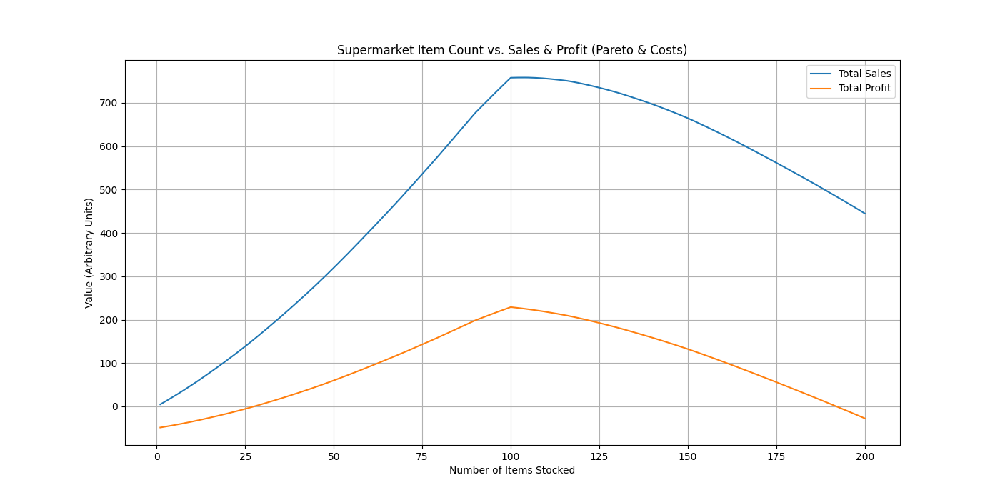
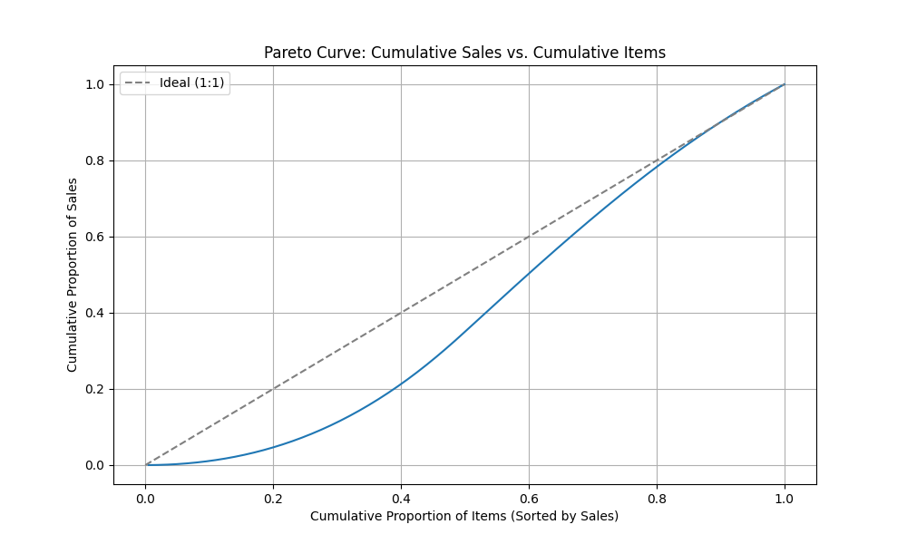

# AI戦略シミュレーション：スーパーマーケットの品揃え、パレートの法則、そして戦略的メリハリ

## はじめに：売上を牽引する「少数精鋭」を見極める

これまでのシミュレーションで、スーパーマーケットの品揃えは、単に多ければ良いわけではなく、売上や利益を最大化する「ほどほどの程度」が存在することを示してきました。しかし、現実のビジネスでは、「どの品目がどれだけ貢献しているか」という質的な視点が不可欠です。ご指摘の通り、全体の売上の大部分を少数の品目が占める「パレートの法則」は、多くのビジネスで観察されます。

本稿では、このパレートの法則をシミュレーションモデルに組み込み、品目ごとの貢献度を可視化することで、より実践的な品揃え戦略における「ほどほどの程度」と、そこから導かれる戦略的なメリハリについて、AIの視点から深く考察します。

## シミュレーション設計：パレートの法則を組み込む

今回のシミュレーションでは、以下の要素をモデルに追加しました。

*   **品目ごとの売上貢献度の生成:**
    *   総品目数（200品目）に対して、パレートの法則（上位の少数の品目が売上の大部分を占める）に従って、各品目の「潜在的な売上貢献度」を割り振りました。これにより、売れ筋商品とそうでない商品の差を明確に表現しています。
*   **品目ごとのコスト計算:**
    *   各品目には、仕入れコストや管理コストといった変動費を割り当て、店舗全体の固定費も考慮しました。
*   **品目追加戦略:**
    *   品目数を増やす際には、売上貢献度の高い品目から順に追加していく戦略をシミュレートしました。これにより、効率的な品揃えの拡大を想定しています。
*   **「選択肢過多」と「競合」の影響の再統合:**
    *   前回の高度化版で導入した「選択肢過多による顧客離脱」と「競合店の存在」の影響も、品目ごとの売上貢献度と統合し、総売上と総利益に反映させています。

## シミュレーション結果：パレートの法則が示す最適点

AIによるシミュレーションを実行した結果、以下の2つのグラフを得ることができました。

### 1. 品目数と総売上・総利益の推移

このグラフは、品目数を増やしていくにつれて、総売上と総利益がどのように変化するかを示しています。売上は品目数が増えるにつれて増加しますが、ある点で頭打ちになり、その後は減少傾向に転じます。利益も同様に、売上よりも早い段階でピークを迎え、その後はコストの増加により減少します。これは、前回のシミュレーションで示された「ほどほどの程度」の存在を再確認するものです。

### 2. パレート曲線：累積売上と累積品目の関係

このパレート曲線は、品目数を売上貢献度の高い順に並べた場合の、累積品目割合に対する累積売上割合を示しています。グラフの曲線が理想的な1:1の直線から大きく乖離していることから、**少数の品目が売上の大部分を占める「パレートの法則」が明確に現れている**ことがわかります。例えば、このシミュレーションでは、上位約20%の品目が総売上の約80%を占める傾向が見られます。

## AIによる分析と考察：戦略的メリハリの重要性

今回のシミュレーション結果は、スーパーマーケットの品揃え戦略において、以下の重要な洞察を提供します。

*   **「ほどほどの程度」の再定義:** 単に品目数を減らすだけでなく、**「どの品目を残し、どの品目を削減するか」**という質的な判断が、売上と利益の最大化に不可欠であることがパレート曲線から明確に示されました。真の「ほどほどの程度」は、利益を最大化する品目数であると同時に、その品目群が売上貢献度の高い「少数精鋭」であるべきだと言えます。
*   **戦略的なメリハリ:**
    *   **上位品目への集中:** パレート曲線が示すように、売上貢献度の高い上位の品目（例えば上位20%）に経営資源（陳列スペース、プロモーション、在庫管理）を集中させることで、効率的に売上と利益を伸ばすことができます。
    *   **下位品目の見直し:** 売上貢献度の低い下位の品目（例えば下位80%）については、コスト（在庫管理コスト、陳列コストなど）とのバランスを考慮し、削減や入れ替えを検討する戦略的なメリハリが重要です。
    *   **顧客セグメントへの対応:** 品揃え重視顧客と効率重視顧客のバランスを考慮し、両方のニーズに応えつつも、利益率の高い品目を優先するなどの調整が必要です。

## 結論：データが導く、アクションに繋がる最適化

今回のAI主導シミュレーションは、スーパーマーケットの品揃え戦略において、パレートの法則という普遍的なビジネス原則を組み込むことで、より実践的で具体的な意思決定に繋がる洞察を提供しました。個人の経験や直感だけでは見落としがちな、品目ごとの貢献度の差を明確に可視化し、そこから「どの品目に注力すべきか」「どの品目を見直すべきか」という具体的なアクションを導き出すことが可能になります。

AIを活用することで、私たちは今後も、人間の知識や経験の範囲を超えた、客観的で実践的な洞察を提供し続けていきます。これは、複雑なビジネス環境において、データに基づいた戦略的なメリハリが、持続的な成長と収益性確保の鍵となることを示唆しています。
